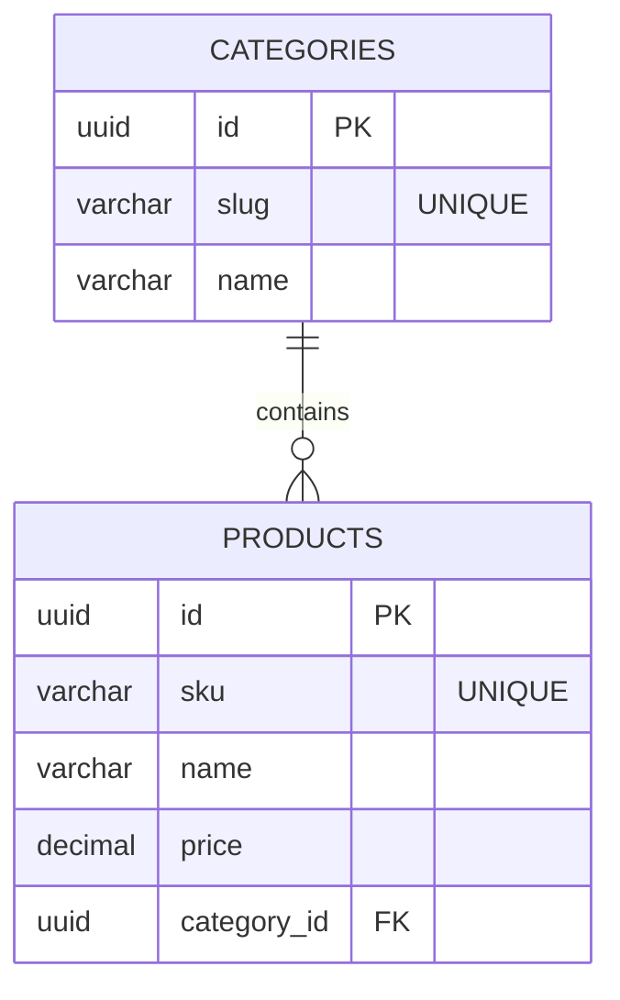

# Example: Database Schema

> [!NOTE] 
> This is a generalized example of a Database Schema for a standard "E-commerce Product Catalog". Use this to understand how to document tables, types, and indexes.

## 1. Schema Diagram

## 2. Table Details

### Table: `categories`
**Description:** Product categories used for taxonomy and navigation.
**Partitioning/Indexing:** Unique B-Tree index on `slug`.

| Column Name | Data Type | Constraints | Description |
| :--- | :--- | :--- | :--- |
| `id` | UUID | Primary Key | Identifier |
| `slug` | VARCHAR(100) | Unique, Not Null | URL-friendly identifier (e.g., 'mens-shoes') |
| `name` | VARCHAR(100) | Not Null | Display name |

### Table: `products`
**Description:** Individual sellable items.
**Partitioning/Indexing:** B-Tree index on `sku` for fast barcode lookups.

| Column Name | Data Type | Constraints | Description |
| :--- | :--- | :--- | :--- |
| `id` | UUID | Primary Key | Identifier |
| `sku` | VARCHAR(50) | Unique, Not Null | Stock Keeping Unit |
| `name` | VARCHAR(255) | Not Null | Product name |
| `price` | DECIMAL(10,2)| Not Null | Current selling price |
| `category_id`| UUID | Foreign Key -> categories(id) | Parent category |

## 3. Security & Access Logic
- Public catalog operations only have `SELECT` access to `categories` and `products`.
- Only backend services authenticated with `ADMIN_ROLE` can perform `INSERT/UPDATE/DELETE`.
