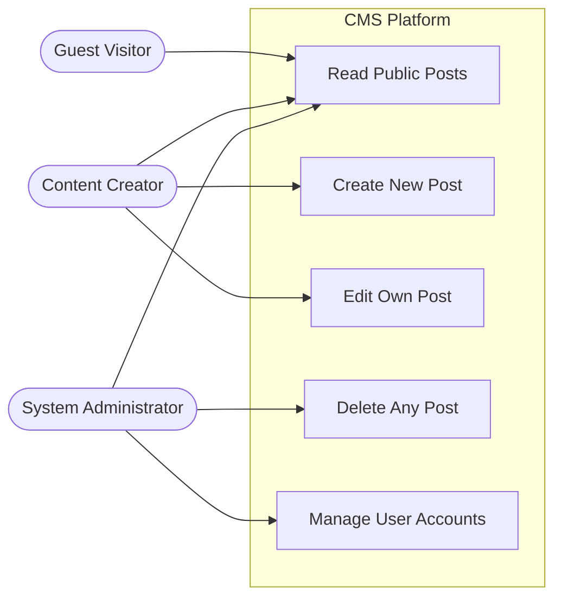

# Example: Use Case Diagram

> [!NOTE] 
> This is a generalized example of a Use Case Diagram for a standard "Content Management System (CMS)". Use this as a reference to understand how actors and interactions should be modeled.

## 1. Actors & Permissions
- **Guest Visitor:** Unauthenticated user browsing public posts.
- **Content Creator:** Authenticated user with permissions to write and edit their own posts.
- **System Administrator:** High-privilege user capable of managing users and deleting any post.

## 2. Diagram

## 3. Critical Backend Interactions
- **Delete Any Post:** When an Admin deletes a post, the system must cascade the deletion to remove all associated comments and media attachments from the S3 bucket to prevent orphaned data.
