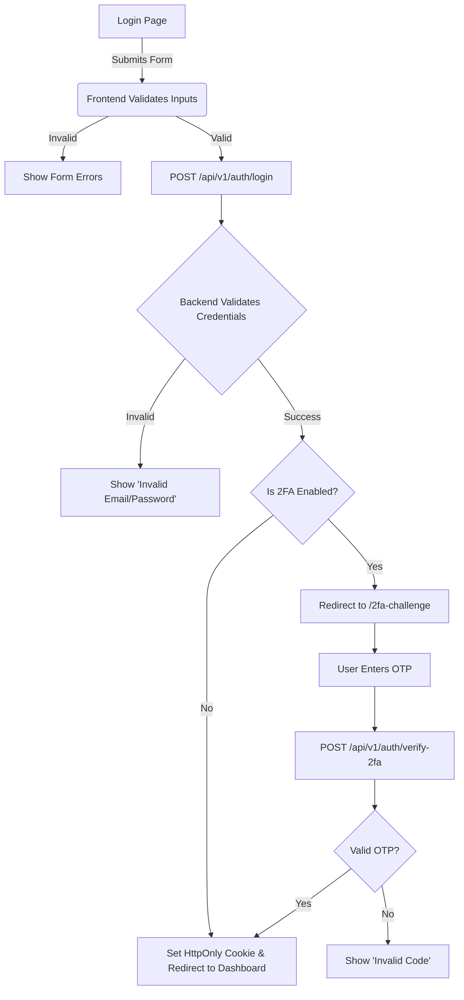

# Example: User Flow Diagram

> [!NOTE] 
> This is a generalized example of a User Flow Diagram for a standard "User Login & Password Reset" process. Use this to understand how to map out complex edge cases.

## Flow 1: Standard Login with 2FA

### Description
The flow of an existing user attempting to log in, including the edge case where they have Two-Factor Authentication (2FA) enabled.

### Sequence/Diagram

