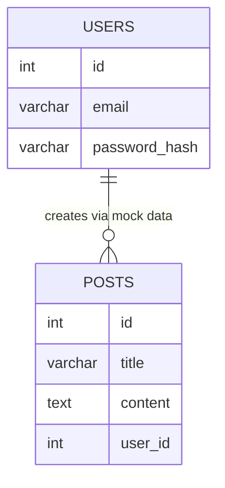

# Database Schema

Often, an MVP focuses heavily on the frontend and may utilize mocked or hardcoded data structures instead of a formal database schema. 

## Mocked Data Structures

If no formal database is used, document the essential data objects simulated in the logic.

```javascript
const MOCK_USER = {
  id: 1,
  email: 'demo@orionex.com',
  name: 'Demo User',
  role: 'admin'
};
```

## Formal Database Schema

If the MVP does employ a lightweight database (e.g., SQLite, Firebase), provide the schema details below. Consider using Mermaid.js for visual representation.

### Schema Diagram



### Table Details

**Table:** `users`
**Description:** Stores mock user credentials for the demo.

| Column Name | Data Type | Constraints | Description |
| :--- | :--- | :--- | :--- |
| `id` | INT | Primary Key, Auto Increment | Unique identifier |
| `email` | VARCHAR(255) | Unique, Not Null | User's mock email address |
| `password_hash` | VARCHAR(255) | Not Null | Hashed password (even in mocks) |
