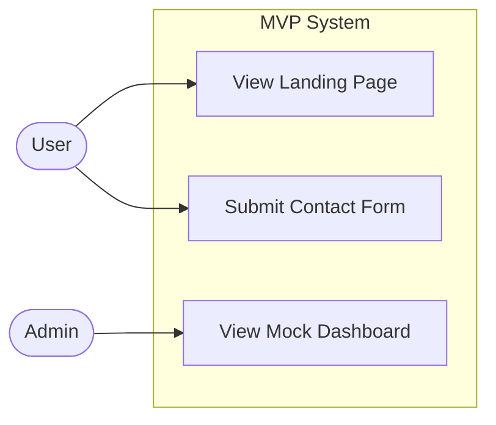

# Use Case Diagram

This document illustrates the interactions between users (actors) and the system for the MVP scope.

## 1. Actors
List and describe the primary actors engaging with the system during the demo.
- **Actor 1 [e.g., User]:** [Description, e.g., A general user interacting with the public-facing pages.]
- **Actor 2 [e.g., Admin]:** [Description, e.g., A system administrator managing the backend mock data.]

## 2. Diagram
Embed your use case diagram here. 

*(Example using Mermaid.js)*

## 3. Notable Edge Cases
Are there any specific scenarios we should be aware of during the demo? (e.g., If the user enters a specific mock email, show an error state).
