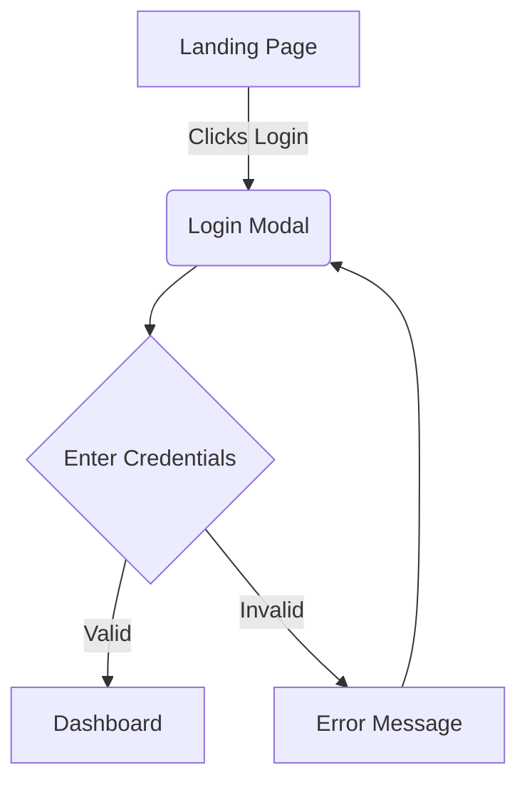

# User Flow Diagrams

This document outlines the specific screen-by-screen flows for the MVP. You can embed images (e.g., from Figma or draw.io) or use Mermaid.js syntax.

## Flow 1: [Name of the Flow, e.g., User Authentication]

### Description
Brief explanation of what the user is trying to accomplish in this flow.

### Sequence/Diagram
*(Example using Mermaid.js)*

## Flow 2: [Name of the second flow]
... (Repeat formatting)
