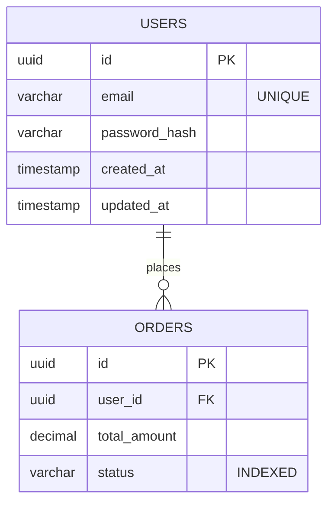

# Database Schema (V1 Production)

This document contains the comprehensive database schema utilized for the V1 production release. Unlike the MVP mocks, this details actual tables, indexes, and relationships.

## 1. Schema Diagram

Use Mermaid.js to define the rigorous ER Diagram representing the V1 databases.

## 2. Table Details

For every table, detail its columns, constraints, indexing strategies, and purpose.

### Table: `users`
**Description:** Central table managing authentication details and generic profile linkages.
**Partitioning/Indexing:** B-Tree index on `email` column for fast authentication lookups.

| Column Name | Data Type | Constraints | Description |
| :--- | :--- | :--- | :--- |
| `id` | UUID | Primary Key | Standard primary identifier (avoids sequential predictability). |
| `email` | VARCHAR(255) | Unique, Not Null | Normalized user email |
| `password_hash` | VARCHAR(255)| Not Null | BCrypt hashed string |
| `created_at` | TIMESTAMPTZ | Default NOW() | Audit timestamp |
| `updated_at` | TIMESTAMPTZ | Default NOW() | Automatically updated via trigger |

### Table: `orders`
**Description:** Core transactional table tracking user purchases.
**Partitioning/Indexing:** Compound index on `(user_id, status)` for specific query optimization.

| Column Name | Data Type | Constraints | Description |
| :--- | :--- | :--- | :--- |
| `id` | UUID | Primary Key | Order identifier |
| `user_id` | UUID | Foreign Key -> users(id) | Reference to purchasing user |
| `status` | ENUM | Defaults 'PENDING' | Status enum: PENDING, PAID, FAILED |
| `total_amount`| DECIMAL(12,2)| Not Null | Pre-calculated total cost |

## 3. Security & Access Logic
Detail any specific Row-Level Security (RLS) policies or specific database views used to secure data access logic.
