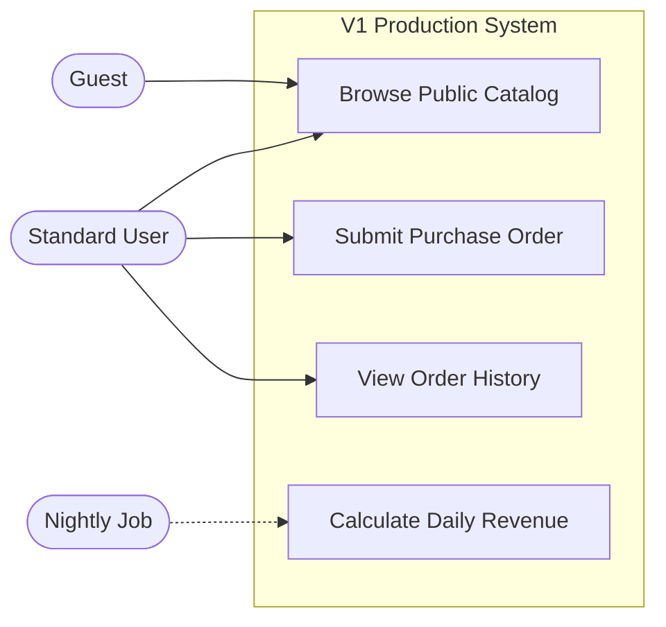

# V1 Use Case Diagram

This document illustrates the interactions between users (actors) and the complete V1 system, accounting for actual backend permissions and system responses.

## 1. Actors & Permissions
Unlike the MVP, the V1 actors usually correspond to specific database Roles (RBAC).
- **Actor 1 [e.g., Guest User]:** Unauthenticated user browsing public catalogs.
- **Actor 2 [e.g., Standard User]:** Authenticated user with standard permissions.
- **Actor 3 [e.g., Super Admin]:** High-privilege user capable of modifying system settings and roles.
- **System Actor [e.g., Nightly Cron Job]:** Automated service executing background tasks.

## 2. Diagram
Embed your comprehensive V1 use case diagram here. Ensure error/edge cases and complex backend interactions are modeled.

*(Example using Mermaid.js)*

## 3. Critical Backend Interactions
List specific use cases that trigger complex backend workflows (e.g., third-party API calls, asynchronous queues) which weren't present in the MVP.
- **Submit Purchase Order:** Triggers synchronous Stripe API call, followed by an asynchronous email receipt via SendGrid.
