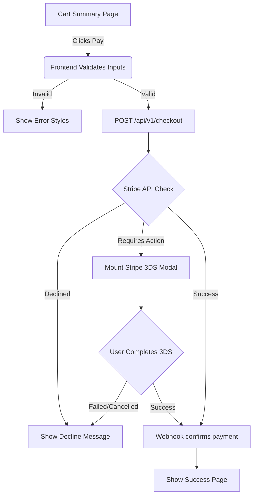

# V1 User Flow Diagrams

This document details the complete, screen-by-screen (and logic-by-logic) flows for the production application. Unlike MVP flows which just show the "happy path," V1 flows must detail edge cases, error states, and background processing.

## Flow 1: [Complex Flow, e.g., Checkout with 3D Secure Verification]

### Description
Detailed description of the user experience, explicitly including the backend validation steps and potential fail states (e.g., card declined, 3DS authentication required by bank).

### Sequence/Diagram
*(Example using Mermaid.js)*

## Flow 2: [Next Complex Flow]
... (Repeat formatting for major epics)
